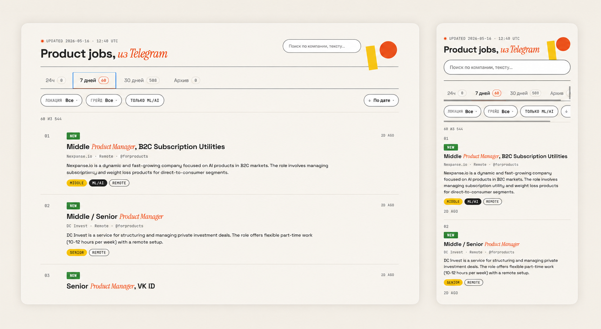

# tg_digest

**Your personal Product/PM vacancy radar — built on Telegram, powered by Claude, served on GitHub Pages.**

Forget scrolling through twelve job channels every morning. `tg_digest` watches a folder of Telegram channels, filters out everything that isn't a vacancy, lets Claude Haiku pull out the structured stuff (company, grade, salary, remote, ML/AI focus), kills duplicates, and serves you a clean, searchable, filterable digest. Every morning at 09:00 MSK. On autopilot. For free.

**[Live demo →](https://evazemtsova.github.io/tg_digest/)**



---

## Why this exists

Twelve Telegram channels post 50+ job posts a day. Maybe two of them are actually relevant. Reading all of them by hand is the worst part of looking for a Product job.

`tg_digest` solves exactly that one problem:

- **One page, all channels, deduplicated.** A vacancy that got cross-posted to four channels shows up once.
- **Filter, don't scroll.** Filters by grade, location, remote, ML/AI focus. Search across company and full text.
- **Real source, one click away.** Click any card → the full original Telegram post opens in a modal, with all links from the post (including hidden ones) clickable.
- **Smart enough to know what's a job.** A two-stage filter (regex → Claude Haiku) keeps the noise out. Memes, news, and "vacancy of the day" listicles don't make it in.

## What you get

| Feature | What it does |
|---|---|
| **Daily auto-digest** | Runs every day at 09:00 MSK via GitHub Actions. Zero ongoing maintenance. |
| **Cross-channel dedup** | Same vacancy in 4 channels = one card with a `×4` badge listing all sources. |
| **AI-extracted metadata** | Company, grade (Junior → Head), location, salary, remote flag, ML/AI flag — all pulled by Claude Haiku, not regex. |
| **Full text + clickable links** | Tap a card → modal with the full TG post and every link (including hidden `[text](url)` ones) preserved. |
| **NEW badge for fresh posts** | Anything posted in the last 24h gets a NEW tag, so you spot what changed since yesterday. |
| **Mobile-first** | The whole UI works on a phone. The desktop layout is the bonus, not the other way around. |
| **Free to run** | GitHub Pages + GitHub Actions free tier. Only paid bit is Claude Haiku — ~$0.30/month for ~500 vacancies. |

---

## How it works

A six-step pipeline. Each step reads a JSON file from `data/` and writes the next one — so any step can be debugged in isolation.

```
fetch_tg  →  parse  →  enrich  →  deduplicate  →  state  →  render
 Telethon    regex     Haiku     SequenceMatcher   NEW     Jinja2
```

1. **`fetch_tg`** — reads a Telegram folder via Telethon. Adding a channel to the folder in TG auto-includes it next run. Captures message entities so hidden links (`[click here](https://...)`) survive.
2. **`parse`** — fast regex prefilter to drop anything that obviously isn't a vacancy.
3. **`enrich`** — sends what survives to Claude Haiku with a structured-output prompt. Gets back JSON with title, company, grade, location, salary, remote/ML flags, short description.
4. **`deduplicate`** — `difflib.SequenceMatcher` on normalized text. Merges duplicates across channels into one card with all source links.
5. **`state`** — marks posts as NEW (< 24h, unseen before) or archived (> 30d).
6. **`render`** — Jinja2 template + inline JSON → a single static `index.html`. Client-side filtering, search, infinite scroll.

## Tech stack

- **Backend pipeline:** Python 3.11+, [Telethon](https://github.com/LonamiWebs/Telethon), [Anthropic SDK](https://github.com/anthropics/anthropic-sdk-python) (Claude Haiku), Jinja2
- **Frontend:** Plain JavaScript + CSS, no framework. Search/filter/sort/modal all client-side.
- **Infra:** GitHub Actions (daily cron) + GitHub Pages (static hosting). Zero servers.

---

## Run it yourself

### 1. Clone and install

```bash
git clone https://github.com/<you>/tg_digest.git
cd tg_digest
python3 -m venv .venv
source .venv/bin/activate
pip install -r requirements.txt
cp .env.example .env  # fill in API keys (see below)
```

### 2. Get Telegram API credentials

1. Go to https://my.telegram.org → API Development Tools → create an app.
2. Copy `api_id` and `api_hash` into `.env` as `TG_API_ID` and `TG_API_HASH`.

### 3. Get a Claude API key

Get one at https://console.anthropic.com → put it in `.env` as `ANTHROPIC_API_KEY`.

### 4. Generate a Telegram session (one-time)

```bash
python scripts/generate_session.py
```

Asks for your phone number, login code from Telegram, and 2FA password if you have one. Prints a base64 `StringSession`. Paste it into `.env` as `TG_SESSION_B64` (and into GitHub Secrets later for CI).

### 5. Tell it which channels to read

In your Telegram app, create a folder (default name: `vacancy`) and add the channels you want to track. The pipeline reads whatever is currently in that folder — no separate channel list to maintain.

### 6. Run

```bash
python scripts/main.py
open index.html
```

That's it. You now have your own digest.

## Deploy on GitHub Pages

1. Push to GitHub.
2. **Settings → Pages** → set source to `main` branch, root.
3. **Settings → Secrets and variables → Actions** → add the four secrets below:

| Secret | Where to get it |
|---|---|
| `TG_API_ID` | https://my.telegram.org |
| `TG_API_HASH` | https://my.telegram.org |
| `TG_SESSION_B64` | Output of `generate_session.py` |
| `ANTHROPIC_API_KEY` | https://console.anthropic.com |

The included GitHub Actions workflow runs the pipeline daily, commits the regenerated `data/` and `index.html`, and GitHub Pages serves it.

## Configuration

`config/sources.yml`:

```yaml
tg_folder_name: vacancy        # the Telegram folder to watch
initial_backfill_days: 30      # how far back the first run reaches
archive_after_days: 30         # vacancies older than this move to Archive tab
new_window_hours: 24           # how recent counts as NEW
```

`scripts/enrich.py` — change the system prompt here if you want different fields extracted (e.g. tech stack, industry, company size).

`scripts/parse.py` — the regex prefilter. Tighten or loosen depending on your channels' style.

---

## License

MIT. Use it, fork it, make it yours.
